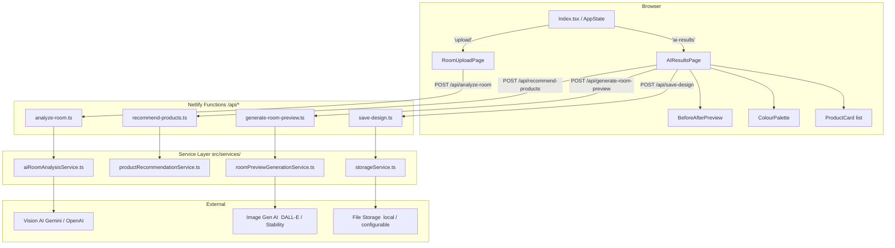
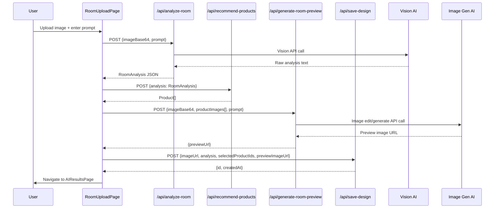

# Design Document: AI Room Personalization

## Overview

This feature replaces the Qloo-based recommendation flow with a full AI room personalization pipeline. A user uploads a room photo and enters a natural-language prompt; the system analyzes the image with a vision AI, matches products from the local database, generates a before/after room preview, and persists the session. All Qloo references are removed.

The app is a Vite + React + TypeScript SPA that deploys to Netlify. There is no dedicated backend server. Server-side logic is implemented as **Netlify Functions** (Node.js serverless), which are invoked via `POST /api/*` routes. The existing `netlify.toml` already handles the SPA redirect; function files live under `netlify/functions/`.

### Key Design Decisions

- **Netlify Functions over a dedicated server**: The app already deploys to Netlify with no backend. Serverless functions keep the architecture consistent and avoid introducing a new runtime.
- **AI keys stay server-side**: All Gemini/OpenAI/Claude keys are read from Netlify environment variables inside functions, never bundled into the client.
- **Local product database**: Products are stored as a TypeScript module (`src/data/products.ts`) that is imported by the recommendation function. This avoids a database dependency for the MVP while keeping the matching logic testable.
- **Graceful degradation for preview**: If the image-editing AI cannot place real product images, the system falls back to a styled room mockup and labels it "Visual Inspiration Preview".
- **Preserve existing navigation**: The `AppState` union in `Index.tsx` gains `'ai-results'` without removing any existing states.

---

## Architecture



### Data Flow



---

## Components and Interfaces

### Frontend Component Tree

```
Index.tsx (AppState controller)
├── LandingPage          (existing, unchanged)
├── ChoicePage           (existing, unchanged)
├── RoomUploadPage       (new — replaces/extends RoomUpload.tsx)
│   ├── PromptSuggestions (new sub-component)
│   └── ImageDropZone     (new sub-component)
├── AIResultsPage        (new — rendered when AppState = 'ai-results')
│   ├── BeforeAfterPreview (new)
│   ├── ColourPalette      (extends existing src/components/ColorPalette.tsx)
│   ├── ProductCard        (new)
│   └── EmptyState         (new sub-component)
├── StyleQuiz            (existing, unchanged)
├── StyleResults         (existing, unchanged)
├── TrenderSwipeScreen   (existing, unchanged)
└── EnhancedSwipeInterface (existing, unchanged)
```

### RoomUploadPage

Extends the existing `RoomUpload.tsx` with stricter validation and the new AI flow.

```typescript
interface RoomUploadPageProps {
  onAnalysisComplete: (result: AIAnalysisResult) => void;
  onBack: () => void;
}

interface AIAnalysisResult {
  imageBase64: string;
  imageUrl: string;       // URL after storage upload
  analysis: RoomAnalysis;
  products: Product[];
  previewUrl: string | null;
  sessionId: string;
}
```

### AIResultsPage

```typescript
interface AIResultsPageProps {
  result: AIAnalysisResult;
  onBack: () => void;
  onStartOver: () => void;
}
```

### BeforeAfterPreview

```typescript
interface BeforeAfterPreviewProps {
  beforeImageUrl: string;
  afterImageUrl: string | null;
  isLoading: boolean;
  isError: boolean;
  isFallbackMode: boolean;   // true → show "Visual Inspiration Preview" label
  onRetry: () => void;
}
```

### ProductCard

```typescript
interface ProductCardProps {
  product: Product;
}
```

### ColourPalette (extended)

The existing `ColorPalette.tsx` component is extended to accept two named rows:

```typescript
interface ColourPaletteProps {
  recommendedPalette: string[];   // from RoomAnalysis.recommendedPalette
  detectedColors: string[];       // from RoomAnalysis.detectedColors
}
```

---

## Data Models

### RoomAnalysis

```typescript
interface RoomAnalysis {
  roomType: string;                    // e.g. "living room", "bedroom"
  currentStyle: string;                // e.g. "Scandinavian minimalist"
  detectedColors: string[];            // colours observed in the image
  recommendedPalette: string[];        // AI-suggested complementary colours
  designGoal: string;                  // parsed from user prompt
  missingItems: string[];              // items the AI thinks are absent
  recommendedCategories: string[];     // product categories to surface
  reasoning: string;                   // human-readable explanation
}
```

### Product

```typescript
interface Product {
  id: string;
  name: string;
  storeName: string;
  category: string;
  price: number;
  currency: string;
  productUrl: string;
  affiliateUrl: string;
  imageUrl: string;
  cleanImageUrl: string;
  colorTags: string[];
  styleTags: string[];
  materialTags: string[];
  roomTags: string[];
  dimensions: {
    width: string;
    height: string;
    depth: string;
  };
  inStock: boolean;
}
```

### DesignSession

```typescript
interface DesignSession {
  id: string;
  createdAt: string;          // ISO 8601 timestamp
  imageUrl: string;
  analysis: RoomAnalysis;
  selectedProductIds: string[];
  previewImageUrl: string | null;
}
```

### API Request / Response Shapes

```typescript
// POST /api/analyze-room
interface AnalyzeRoomRequest {
  imageBase64: string;   // non-empty base64-encoded image
  prompt: string;        // 1–500 chars, non-whitespace
}
interface AnalyzeRoomResponse {
  analysis: RoomAnalysis;
}
interface AnalyzeRoomError {
  error: string;
}

// POST /api/recommend-products
interface RecommendProductsRequest {
  analysis: RoomAnalysis;
}
interface RecommendProductsResponse {
  products: Product[];
}

// POST /api/generate-room-preview
interface GenerateRoomPreviewRequest {
  imageBase64: string;
  productImageUrls: string[];
  prompt: string;
}
interface GenerateRoomPreviewResponse {
  previewUrl: string;
  isFallback: boolean;
}

// POST /api/save-design
interface SaveDesignRequest {
  imageUrl: string;
  analysis: RoomAnalysis;
  selectedProductIds: string[];
  previewImageUrl: string | null;
}
interface SaveDesignResponse {
  id: string;
  createdAt: string;
}
```

---

## Service Layer Design

All four services live under `src/services/` and are imported by the corresponding Netlify function. They contain no HTTP server logic — they are pure TypeScript modules that accept typed inputs and return typed outputs.

### aiRoomAnalysisService.ts

Responsibilities:
- Sanitize the user prompt (strip prompt-injection patterns)
- Convert base64 image + prompt into a vision AI request
- Parse the AI response into a `RoomAnalysis` object
- Return a structured error if parsing fails

```typescript
// src/services/aiRoomAnalysisService.ts
export async function analyzeRoom(
  imageBase64: string,
  prompt: string
): Promise<RoomAnalysis | { error: string }>;

export function sanitizePrompt(prompt: string): string;

export function parseAnalysisResponse(
  rawText: string
): RoomAnalysis | { error: string };
```

The service reads `process.env.GEMINI_API_KEY` (or `OPENAI_API_KEY`) at call time. It never accepts keys as parameters.

### productRecommendationService.ts

Responsibilities:
- Accept a `RoomAnalysis` and the full product catalogue
- Score each product by counting matching tags across all four dimensions
- Apply budget filter if the prompt contains a price constraint
- Fall back to category-only matching if no products pass all filters
- Return products sorted by score descending

```typescript
// src/services/productRecommendationService.ts
export function recommendProducts(
  analysis: RoomAnalysis,
  catalogue: Product[],
  budgetLimit?: number
): Product[];

export function scoreProduct(
  product: Product,
  analysis: RoomAnalysis
): number;

export function extractBudget(prompt: string): number | null;
```

### roomPreviewGenerationService.ts

Responsibilities:
- Accept the room image, product image URLs, and prompt
- Call the image-generation AI (DALL-E edit or Stability AI)
- Return the generated image URL
- Signal `isFallback: true` if product placement was not possible

```typescript
// src/services/roomPreviewGenerationService.ts
export async function generateRoomPreview(
  imageBase64: string,
  productImageUrls: string[],
  prompt: string
): Promise<{ previewUrl: string; isFallback: boolean } | { error: string }>;
```

### storageService.ts

Responsibilities:
- Accept a base64 image and return a URL
- In development: write to `./tmp/uploads/` and return a relative URL
- In production: configurable via `STORAGE_PROVIDER` env var (e.g. `s3`, `cloudinary`)
- Persist `DesignSession` records (in-memory Map for development, configurable for production)

```typescript
// src/services/storageService.ts
export async function storeImage(
  imageBase64: string,
  mimeType: string
): Promise<string>;   // returns URL

export async function saveSession(
  session: Omit<DesignSession, 'id' | 'createdAt'>
): Promise<DesignSession>;

export async function getSession(id: string): Promise<DesignSession | null>;
```

---

## API Route Contracts (Netlify Functions)

Netlify Functions are placed at `netlify/functions/`. The `netlify.toml` redirect rule `/* → /index.html` does **not** intercept `/api/*` paths because Netlify routes function calls before the redirect rules. Each function file exports a `handler` compatible with `@netlify/functions`.

### POST /api/analyze-room → `netlify/functions/analyze-room.ts`

**Request validation (returns 400 if any fail):**
- `imageBase64` must be a non-empty string
- `prompt` must be a non-empty string, ≤ 500 characters, not purely whitespace

**Success (200):**
```json
{ "analysis": { ...RoomAnalysis } }
```

**Error (400 / 500):**
```json
{ "error": "Descriptive message" }
```

### POST /api/recommend-products → `netlify/functions/recommend-products.ts`

**Request validation (returns 400 if any fail):**
- `analysis` must be present and contain all eight `RoomAnalysis` fields

**Success (200):**
```json
{ "products": [ ...Product[] ] }
```

### POST /api/generate-room-preview → `netlify/functions/generate-room-preview.ts`

**Request validation (returns 400 if any fail):**
- `imageBase64` must be a non-empty string
- `productImageUrls` must be an array (may be empty)
- `prompt` must be a non-empty string

**Success (200):**
```json
{ "previewUrl": "https://...", "isFallback": false }
```

### POST /api/save-design → `netlify/functions/save-design.ts`

**Request validation (returns 400 if any fail):**
- `imageUrl` must be a non-empty string
- `analysis` must be a valid `RoomAnalysis` object
- `selectedProductIds` must be an array of strings

**Success (200):**
```json
{ "id": "uuid-v4", "createdAt": "2024-01-01T00:00:00.000Z" }
```

---

## State Management in Index.tsx

The `AppState` type gains `'ai-results'` without removing existing states:

```typescript
type AppState =
  | 'landing'
  | 'choice'
  | 'upload'
  | 'quiz'
  | 'results'
  | 'swipe'
  | 'enhanced-swipe'
  | 'ai-results';   // NEW
```

A new piece of state holds the AI analysis result:

```typescript
const [aiResult, setAiResult] = useState<AIAnalysisResult | null>(null);
```

Navigation handlers:

```typescript
// Called by RoomUploadPage when the full pipeline completes
const handleAIAnalysisComplete = (result: AIAnalysisResult) => {
  setAiResult(result);
  setCurrentState('ai-results');
};

// Called by AIResultsPage "Back" button
const handleBackFromAIResults = () => {
  setCurrentState('upload');
};

// Called by AIResultsPage "Start Over" button
const handleStartOver = () => {
  setAiResult(null);
  setCurrentState('landing');
};
```

The existing `handleRoomUpload` path (which navigates to `'swipe'`) is preserved unchanged. The new AI flow is triggered when the user submits the form on `RoomUploadPage` and the full pipeline completes.

---

## Correctness Properties

*A property is a characteristic or behavior that should hold true across all valid executions of a system — essentially, a formal statement about what the system should do. Properties serve as the bridge between human-readable specifications and machine-verifiable correctness guarantees.*

### Property 1: File size rejection

*For any* file whose byte size exceeds 10,485,760 bytes (10 MB), the upload validation function should reject it and return a non-empty error message, leaving the current upload state unchanged.

**Validates: Requirements 2.2, 11.1**

---

### Property 2: MIME type rejection

*For any* MIME type string that is not `"image/jpeg"`, `"image/png"`, or `"image/webp"`, the upload validation function should reject it and return a non-empty error message.

**Validates: Requirements 2.3, 11.1**

---

### Property 3: Whitespace prompt disables submission

*For any* string composed entirely of whitespace characters (spaces, tabs, newlines, carriage returns), the `isPromptValid` predicate should return `false`, causing the "Analyze Room" button to be disabled.

**Validates: Requirements 2.5, 11.2**

---

### Property 4: Valid inputs enable submission

*For any* valid image file (correct MIME type, size ≤ 10 MB) and any non-empty, non-whitespace prompt string, the `isFormReady` predicate should return `true`.

**Validates: Requirements 2.6**

---

### Property 5: RoomAnalysis parser completeness

*For any* string that is valid JSON and contains all eight required fields (`roomType`, `currentStyle`, `detectedColors`, `recommendedPalette`, `designGoal`, `missingItems`, `recommendedCategories`, `reasoning`), `parseAnalysisResponse` should return a `RoomAnalysis` object with all eight fields present and non-null.

**Validates: Requirements 3.3**

---

### Property 6: Malformed AI response returns error object

*For any* string that is either not valid JSON or is valid JSON but missing one or more required `RoomAnalysis` fields, `parseAnalysisResponse` should return `{ error: string }` without throwing an exception.

**Validates: Requirements 3.4, 11.5**

---

### Property 7: Server-side prompt validation rejects invalid inputs

*For any* prompt string that is empty, composed entirely of whitespace, or longer than 500 characters, the server-side `validatePrompt` function should return a validation failure result (not throw), and the route handler should respond with HTTP 400.

**Validates: Requirements 3.6, 11.2**

---

### Property 8: Product relevance sort order

*For any* `RoomAnalysis` object and any non-empty product catalogue, the array returned by `recommendProducts` should be sorted such that for every adjacent pair `(products[i], products[i+1])`, `scoreProduct(products[i], analysis) >= scoreProduct(products[i+1], analysis)`.

**Validates: Requirements 4.6**

---

### Property 9: Budget filter correctness

*For any* budget limit `B > 0` and any product catalogue, every product in the array returned by `recommendProducts` should have `product.price <= B`.

**Validates: Requirements 4.4**

---

### Property 10: Prompt sanitization removes injection patterns

*For any* prompt string containing known prompt-injection patterns (e.g. substrings matching `ignore (previous|above) instructions`, `you are now`, `system:`, `<|im_start|>`), the output of `sanitizePrompt` should not contain those patterns.

**Validates: Requirements 11.4**

---

### Property 11: Colour palette rendering completeness

*For any* array of colour name strings passed as `recommendedPalette`, the `ColourPalette` component should render exactly one swatch element per entry, each containing the colour name as visible text.

**Validates: Requirements 7.1, 7.4**

---

### Property 12: Unknown colour name renders placeholder

*For any* colour name string that does not appear in the known CSS colour / hex lookup table, the `ColourPalette` component should render a swatch with a neutral background colour and display the colour name as text (not an empty or broken swatch).

**Validates: Requirements 7.3**

---

### Property 13: ProductCard renders all required fields

*For any* `Product` record, the rendered `ProductCard` component should contain: the product image (src = `cleanImageUrl` or `imageUrl`), the product name, the store name, the price formatted with currency, a "Buy Now" anchor whose `href` equals `affiliateUrl` (or `productUrl` as fallback), and one badge element per entry in `styleTags`.

**Validates: Requirements 8.2, 8.4**

---

### Property 14: Out-of-stock products disable buy button

*For any* `Product` where `inStock` is `false`, the rendered `ProductCard` should display an "Out of Stock" badge and the "Buy Now" button should have the `disabled` attribute set.

**Validates: Requirements 8.3**

---

### Property 15: Save-design round trip

*For any* valid `SaveDesignRequest` (non-empty `imageUrl`, valid `RoomAnalysis`, non-empty `selectedProductIds` array), calling `saveSession` and then `getSession` with the returned `id` should return a `DesignSession` whose `imageUrl`, `analysis`, and `selectedProductIds` fields are deeply equal to the original request values.

**Validates: Requirements 9.1, 9.2**

---

### Property 16: Save-design response shape

*For any* valid `SaveDesignRequest`, the response from `POST /api/save-design` should contain a non-empty `id` string and a `createdAt` string that parses as a valid ISO 8601 date.

**Validates: Requirements 9.2**

---

### Property 17: Error isolation — other sections remain visible

*For any* single-section error (analyze-room, recommend-products, generate-room-preview, or save-design), the `AIResultsPage` should render the sections that completed successfully and show a "Try Again" button only in the errored section.

**Validates: Requirements 10.2, 10.4**

---

### Property 18: No stack traces in user-facing error messages

*For any* error thrown internally (network error, parse error, validation error), the string rendered in the UI should not match the pattern `/at\s+\w+\s*\(/` (stack frame pattern) and should not contain file path separators (`/` or `\` in a path context).

**Validates: Requirements 10.5**

---

## Error Handling Strategy

### Client-side

Each async operation in `RoomUploadPage` and `AIResultsPage` is wrapped in a `try/catch`. Errors are stored in per-section state (`analyzeError`, `productsError`, `previewError`, `saveError`). Each section renders independently — an error in one section does not unmount others.

```typescript
// Pattern used in AIResultsPage
const [analyzeError, setAnalyzeError] = useState<string | null>(null);
const [productsError, setProductsError] = useState<string | null>(null);
const [previewError, setPreviewError] = useState<string | null>(null);
```

User-facing error messages are plain English strings. Raw `Error.message` values from network calls are logged to the console but never rendered directly.

### Server-side (Netlify Functions)

Each function follows this pattern:

1. **Validate inputs** → return 400 with `{ error: "..." }` if invalid
2. **Call service** → wrap in `try/catch`
3. **On service error** → `console.error(err)` (captured by Netlify logs), return 500 with `{ error: "Something went wrong. Please try again." }`
4. **Never** propagate stack traces or internal messages to the response body

### AI API Failures

- Non-2xx HTTP from vision AI → `aiRoomAnalysisService` returns `{ error: string }`
- Non-JSON response from vision AI → `parseAnalysisResponse` catches `JSON.parse` error, returns `{ error: string }`
- Image generation failure → `roomPreviewGenerationService` returns `{ error: string }`; the function returns 500; the client shows the error state in the preview panel only, products remain visible

---

## Security Considerations

### API Key Protection

- All AI API keys (`GEMINI_API_KEY`, `OPENAI_API_KEY`, `STABILITY_API_KEY`) are set as Netlify environment variables
- They are read via `process.env.*` inside Netlify Functions only
- They are never passed as function parameters, never returned in responses, and never referenced in any file under `src/` (the client bundle)
- The `.env.example` file lists only `GEMINI_API_KEY`, `OPENAI_API_KEY`, `STABILITY_API_KEY`, and `STORAGE_PROVIDER` — no Qloo keys

### Input Validation

All inputs are validated on both the client (for UX) and the server (for security):

| Input | Client check | Server check |
|---|---|---|
| Image MIME type | Accept attribute + JS check | MIME sniffing on base64 prefix |
| Image size | File.size check | base64 length check (base64 len × 0.75 ≈ bytes) |
| Prompt length | maxLength=500 | `prompt.trim().length` check |
| Prompt content | Non-empty check | Whitespace-only check |

### Prompt Injection Mitigation

`sanitizePrompt` in `aiRoomAnalysisService.ts` applies these transformations before the prompt is embedded in the AI system message:

1. Strip substrings matching known injection phrases (case-insensitive): `ignore (previous|above) instructions`, `you are now`, `disregard`, `system:`, `<|im_start|>`, `<|im_end|>`
2. Truncate to 500 characters after sanitization
3. Wrap the prompt in a fixed template that constrains the AI's role: `"You are an interior design assistant. Analyze the room image based on this user request: {sanitizedPrompt}. Respond only with valid JSON matching the RoomAnalysis schema."`

### File Upload Security

- Only `image/jpeg`, `image/png`, and `image/webp` are accepted
- The base64 string is validated server-side before being passed to any AI API
- Stored images are given UUID-based filenames to prevent path traversal

---

## Testing Strategy

### Unit Tests (Vitest)

Focus on pure functions and component rendering with concrete examples:

- `parseAnalysisResponse`: valid JSON → correct `RoomAnalysis`; invalid JSON → `{ error }` object
- `scoreProduct`: known product + known analysis → expected score
- `extractBudget`: prompt strings with and without budget constraints
- `sanitizePrompt`: prompts with and without injection patterns
- `validatePrompt`: empty, whitespace, too-long, and valid prompts
- `ProductCard`: renders all fields, out-of-stock state, style tag badges
- `BeforeAfterPreview`: loading state, error state, fallback label
- `ColourPalette`: known colour names, unknown colour names, empty array

### Property-Based Tests (fast-check, minimum 100 iterations each)

Each property test is tagged with a comment referencing the design property it validates.

```typescript
// Feature: ai-room-personalization, Property 1: File size rejection
// Feature: ai-room-personalization, Property 2: MIME type rejection
// Feature: ai-room-personalization, Property 3: Whitespace prompt disables submission
// ... etc.
```

Property tests cover Properties 1–18 as defined in the Correctness Properties section. The fast-check library is used for all property tests. Each test runs a minimum of 100 iterations.

### Integration Tests

- `POST /api/analyze-room` with a real (or mocked) vision AI response
- `POST /api/recommend-products` with the full product catalogue
- `POST /api/save-design` → `getSession` round trip
- Verify no API keys appear in function response payloads

### Smoke Tests

- TypeScript compilation (`tsc --noEmit`) passes with zero errors
- No `qlooApi`, `qlooService`, `QlooService`, `gptService`, or `VITE_QLOO_API_KEY` references remain in the codebase
- No AI API key values appear in the client bundle (`dist/`)
- All four Netlify function files exist and export a `handler`
